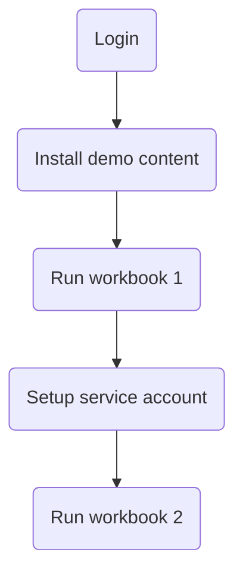
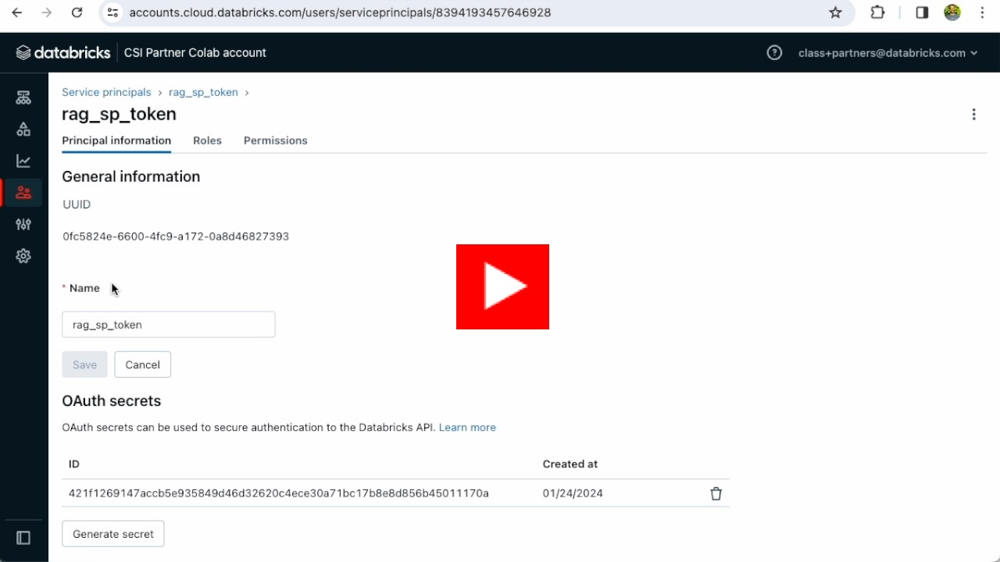

# quickstart-llm-rag-chatbot

This repository contains instructions to quickly get started with the llm-rag-chatbot demo in your Databricks workspace

#### High Level Steps

#### Step 1 - Login

<a href="https://youtu.be/7nsBBZDXHro">

Watch on YouTube

</a>
 

#### Step 4 - Setup Service Account

