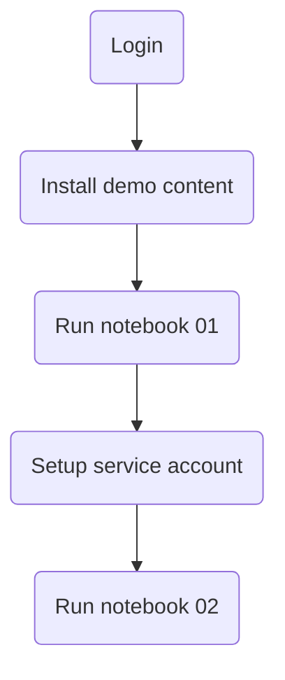
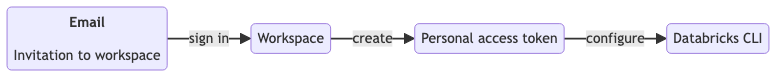
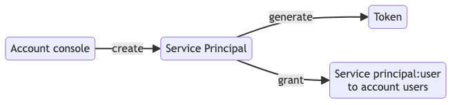

# quickstart-llm-rag-chatbot

This repository contains instructions to quickly get started with the llm-rag-chatbot demo in your Databricks workspace

#### High Level Steps

#### Step 1 - Login

https://github.com/vijaybala-db/quickstart-llm-rag-demo/assets/101297797/6dffd9c9-f8b8-42cd-bf7e-9d205a3fe1b7

#### Step 2 - Install

#### Step 3 - Run Notebook 01

#### Step 4 - Setup Service Account

https://github.com/vijaybala-db/quickstart-llm-rag-demo/assets/101297797/ecc7fe11-4fbf-4e2b-9577-db8eaccfc333

#### Step 5 - Run Notebook 02

