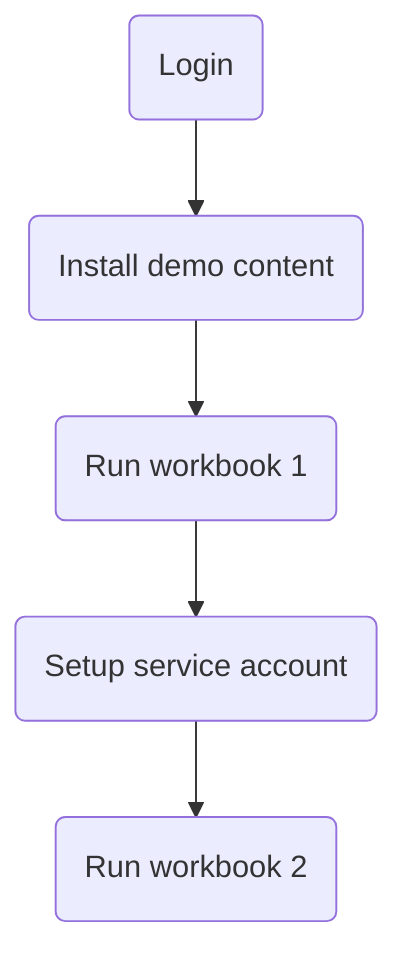

# quickstart-llm-rag-chatbot

This repository contains instructions to quickly get started with the llm-rag-chatbot demo in your Databricks workspace

#### High Level Steps

```mermaid
graph TD;
login(Login) --> install(Install demo content);
install --> run1(Run workbook 1);
run1 --> svc(Setup service account);
svc --> run2(Run workbook 2);
```

#### Step 1 - Login

